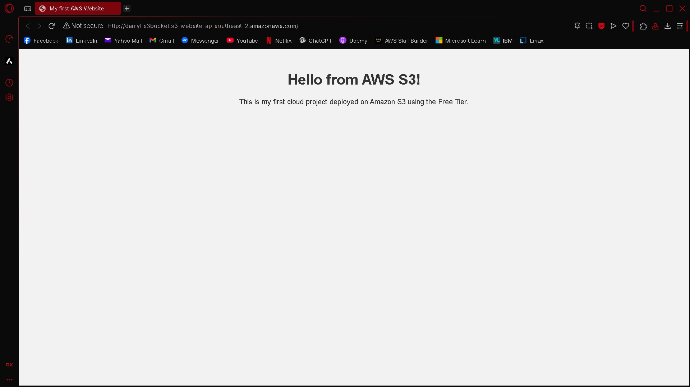
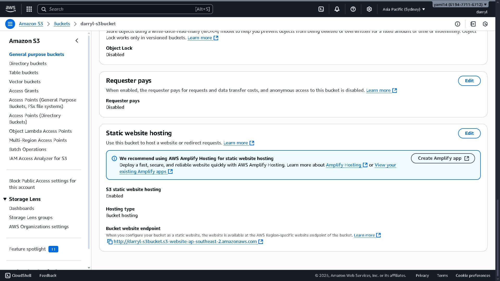
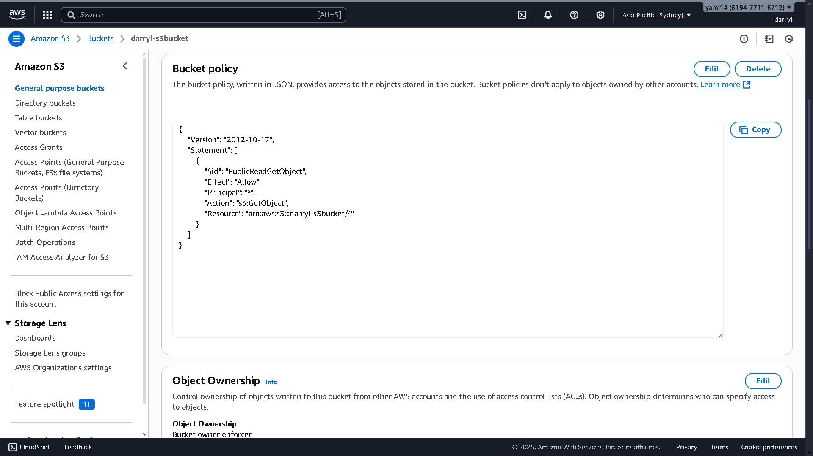

# AWS Static Website Hosting with S3

This project demonstrates how to host a static HTML website on AWS S3 using the Free Tier.

## ✅ Services Used
- Amazon S3 (Static Website Hosting)
- IAM (Bucket Policy)

## 📷 Screenshots

## 🧠 What I Learned
- Setting up S3 for static websites
- Managing public access with bucket policies
- Understanding the AWS Console interface
